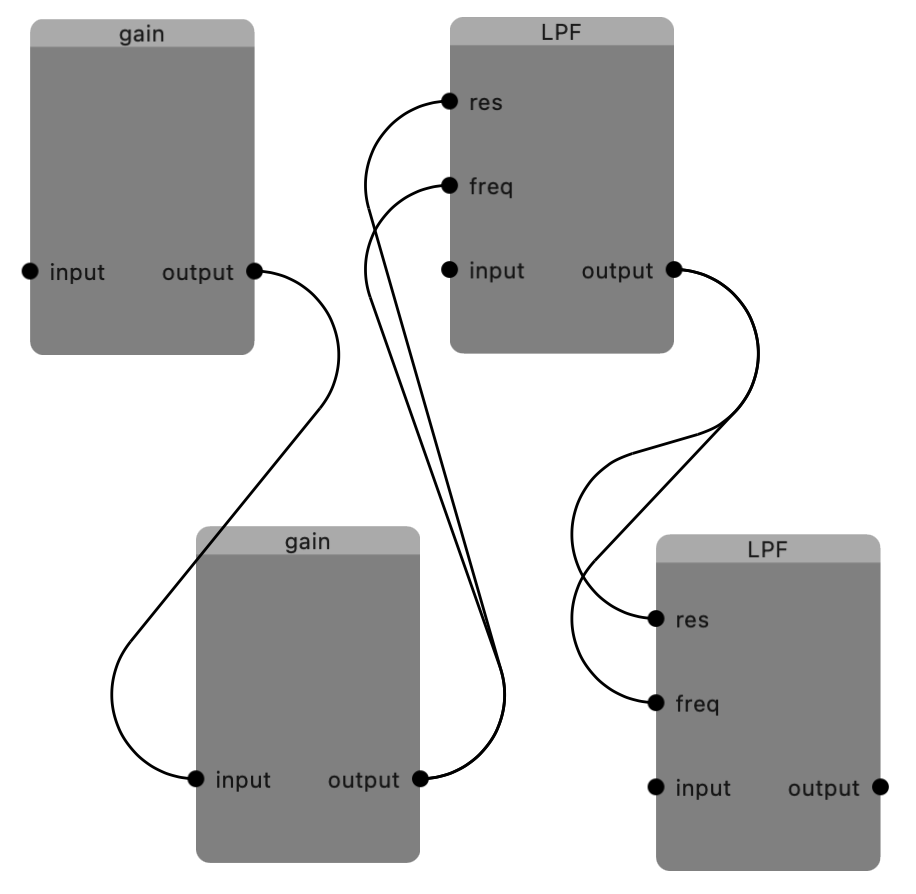

Some back burner project is to make a graphical frontend for
[ZenGarden](https://github.com/mhroth/ZenGarden).

At the time I was playing around with this Houdini 3d modeling + animation
software, and I liked the shape of the lines in its dataflow UI, so I tried
to implement it here.
